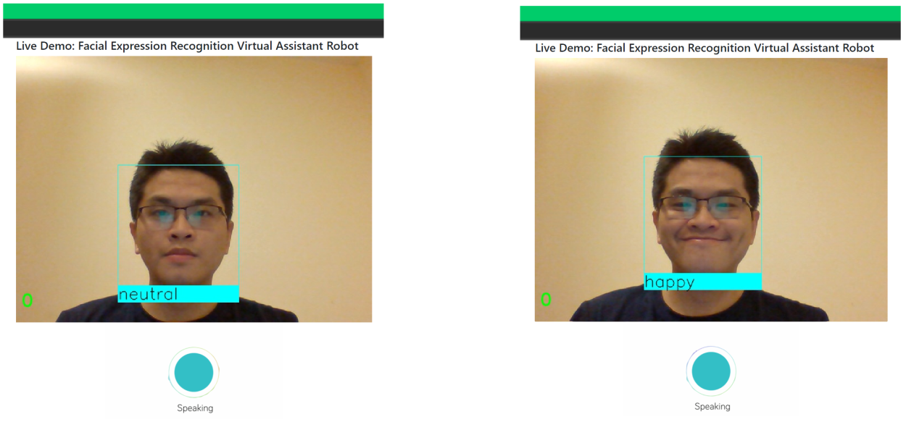

# dl-end-term
## Project summarization
### Update from the Basic Machine Learning project
- Apply DL in solving Facial Expression Recognition problem
- Models used: VGGFace, VGGFace2
- Data augmentation methods: Random Oversampling, ADASYN, SMOTE
- Datasets: FER2013, FER+
- Create a simple web app using Flask simulating a virtual assistant which will response with audio to the corresponsing expression
### Pipeline

### More details
Read our thesis [here](docs/Final_report.pdf)

### How to reproduce the demo

Make sure webcam, speaker is available  
Create the conda environment:
`conda myenv create -f environment.yml`  
Navigate to voice-response/demo/web/flask  
Run `python thread_demo.py`

### Environments
**Windows**, Conda, Python
